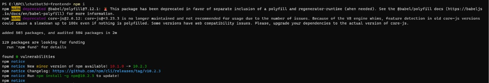
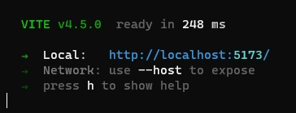

# Setting up the project

## Step 1:
Clone the repository in the folder created, by running the below command in terminal.
`git clone https://github.com/Aditya16828/chatbot3d-frontend.git`

## Step 2:
Now, navigate into the folder named **chatbot3d-frontend** and run
`npm install`

## Step 3:
After the installation of the node-modules is completed, the following will be shown.

## Step 4:
To start the frontend server run `npm run dev`
